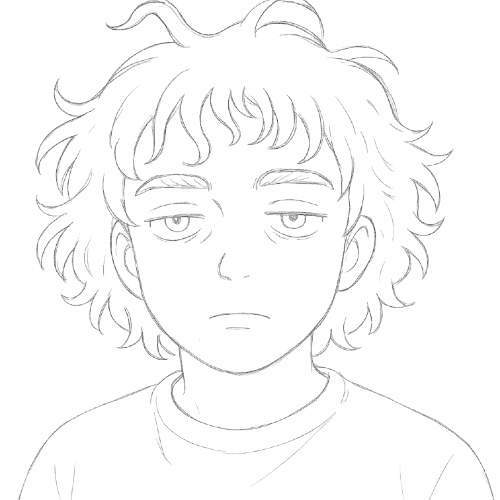

<!-- page: title -->

# Cesar Augusto Nast Lourenzon  
### escritor | storyteller  

---

## Quem é

> Estudante de Publicidade com interesse profundo em narrativas visuais e estratégias criativas. 
> Tenho afinidade com storytelling, branding e o estudo crítico da comunicação contemporânea. 
> Meus projetos buscam provocar reflexão e gerar conexão, sempre com ética, sensibilidade e um olhar atento ao comportamento humano.

--- 
## Sobre Mim

Sua trajetória em Publicidade é marcada por uma abordagem analítica, introspectiva e comprometida com o impacto social da comunicação. Acredita que uma campanha bem feita não apenas vende — ela dialoga, ensina e transforma. Valoriza a clareza, a inteligência e o afeto como estratégias criativas.

---

## Experiências

- Criação de campanhas publicitárias em contextos acadêmicos (briefings reais e fictícios)
- Participação em eventos com profissionais do mercado (como a RBS)
- Desenvolvimento de peças e identidade visual em parceria com colegas
- Escrita de contos e roteiros aplicados ao storytelling publicitário(Datasus, App de Ponto)
---
## Habilidades
- Criação visual: princípios de design, estética e composição
- Redação publicitária: linguagem persuasiva e adaptabilidade de tom
- Planejamento estratégico: análise de público e objetivos criativos
- Ferramentas: Adobe Photoshop, Illustrator, Canva, Google Workspace
- Comportamentais: pensamento crítico, escuta ativa, ética e sensibilidade narrativa

---

## Objetivos com o Portfólio

- Apresentar quem é Cesar Augusto
- Mostrar suas experiencias e habilidades
- Formas de contata-lo

---

## Estrutura do Portfólio

- **Home**: Nome e uma breve identificação
- **Sobre**: Informações relacionadas a objetivos próprios e jornada 
- **Experiências**: Experiencias de trabalho
- **Habilidades Técnicas e Interpessoais**  Habilidades em ferramentas e Soft skills
- **Contato**: LinkedIn, WhatsApp, E-mail

---

## Elementos Visuais

**Cores Modo Escuro:**  
- Azul escuro (#0D1B2A) e Dourado (#D9A441) cores primarias e secundarias: Escolha do Cesar 
- Branco (#F1F3F5) uso no Texto: Clareza nas informações

**Cores Modo Claro:**
- Branco (#F1F3F5) e Dourado (#D9A441) cores primarias e secundarias: Escolha do Cesar 
- Azul escuro (#0D1B2A) uso no Texto: Clareza nas informações e escolha do Cesar

---

## Elementos Visuais

**Formas:** Cantos retos, estrutura mais limpa e Minimalista

**Tipografia:**  
Optado por uma Tipografia com serifa, que passe um estilo mais profissional e refinado
- Títulos: Playfair Display

- Corpo: lato

---

## Acesse o Protótipo

https://cesar-portifolio.pages.dev/